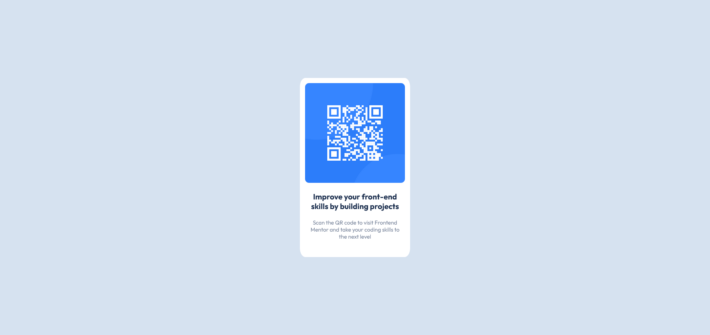

# My web development studies catalogue!
A repository containing code snippets and web development practice studies! The main focus is to exercise CSS, building UI components and hone my skills with Vue.js!

Main technologies used:
Vue.js
shadcd/ui
Tailwind
Vanilla CSS
HTML

# Here are some of the projects the i've done!

## Table of contents

- [QR-Code Card](#QR-code-component)

# QR code component

This is a solution to the [QR code component challenge on Frontend Mentor](https://www.frontendmentor.io/challenges/qr-code-component-iux_sIO_H).

## Table of contents

- [Overview](#overview-QRcode)
  - [Screenshot](#screenshot-QRcode)
  - [Links](#links-QRcode)
- [My process](#my-process-QRcode)
  - [Built with](#built-with-QRcode)
  - [What I learned](#what-i-learned-QRcode)
  - [Useful resources](#useful-resources-QRcode)
- [Author](#author)

## Overview QRCode

### Screenshot QRCode

Final version!



### Links QRCode

- Solution URL: [Github repository](https://github.com/amorabot/web-dev)
- Live Site URL: [Deployed app URL](https://amorabot.vercel.app/)

## My process QRCode

### Built with QRCode

- HTML5
- CSS
- Flexbox basics
- Grid basics

### What I learned QRCode

This project was great for starting to get hands-on experience with the essentials of CSS. It was very useful for getting a better understanding of flex and grid containers, their properties and their child's properties (especially getting a better grasp of grid-template-rows/columns property). It was also great for experimenting with auto and % units for component spacing!

Below are some highlighted code snippets from the main CSS class:

```css
* {
    min-width: 0;
}

#qr-code-data{
    display: grid;
    grid-template-rows: max-content min-content min-content;

    align-self: center;

    background-color: var(--white);
    padding: 14px;
    margin-inline: 10px;
    border-radius: 5%;
    max-width: 270px;
    min-height: 450px;
}
```

### Useful resources QRCode

- [MDN Docs - Sizing items](https://developer.mozilla.org/en-US/docs/Learn/CSS/Building_blocks/Sizing_items_in_CSS) - Great visual examples of different components needing different treatments for reaching a final goal.
- [CSS Tricks - Flexbox guide](https://css-tricks.com/snippets/css/a-guide-to-flexbox/#aa-examples) - Godly flexbox demonstrations.
- [CSS Tricks - Grid guide](https://css-tricks.com/snippets/css/complete-guide-grid/#aa-introduction) - Godly grid demonstrations.
- [CSS Tricks - Flex property](https://css-tricks.com/almanac/properties/f/flex/) - Shows many flex uses for the property and some nice practical examples.
- [Kevin powell - A practical guide to responsive web design](https://www.youtube.com/watch?v=x4u1yp3Msao) - Great visual examples and practical guidelines for better responsive layouts!.

## Author

- Website - [amorabot](https://amorabot.github.io/)
- Frontend Mentor - [@amorabot](https://www.frontendmentor.io/profile/amorabot)